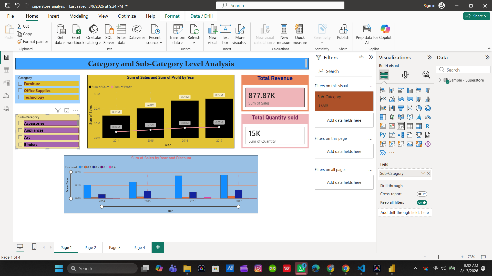

# Superstore Sales Analysis – Power BI

An interactive Power BI dashboard built to analyze sales, profit, quantity,
customer segments, product categories, shipping modes, and geographic
performance using the Superstore dataset.

## 📊 Dashboard Overview

The project contains four interactive dashboard pages covering:

- Category and sub-category performance
- Sales and profit trends over time
- Customer segment analysis
- Geographic sales analysis
- Shipping mode analysis
- Regional and state-level performance
- Sales and quantity KPIs
- Product and category comparisons

## 🛠️ Tools & Technologies

- Power BI
- Power Query
- DAX
- Data Visualization
- Data Cleaning & Transformation
- Superstore Dataset

## 📈 Key Metrics

- Total Sales
- Total Profit
- Total Quantity
- Sales by Category
- Profit by Segment
- Sales by Region
- Sales by City
- Shipping Mode Analysis

## 📷 Dashboard Preview

### 1. Category & Sub-Category Analysis

### 2. Geographic Sales Analysis

### 3. Segment & Profit Analysis

### 4. Sales, Quantity & Shipping Analysis

## 🎯 Objective

The objective of this project is to transform raw sales data into an
interactive business intelligence dashboard that helps identify sales
trends, profitable segments, high-performing categories, and geographic
patterns.

## 👤 Author

Priyansu Choudhury
